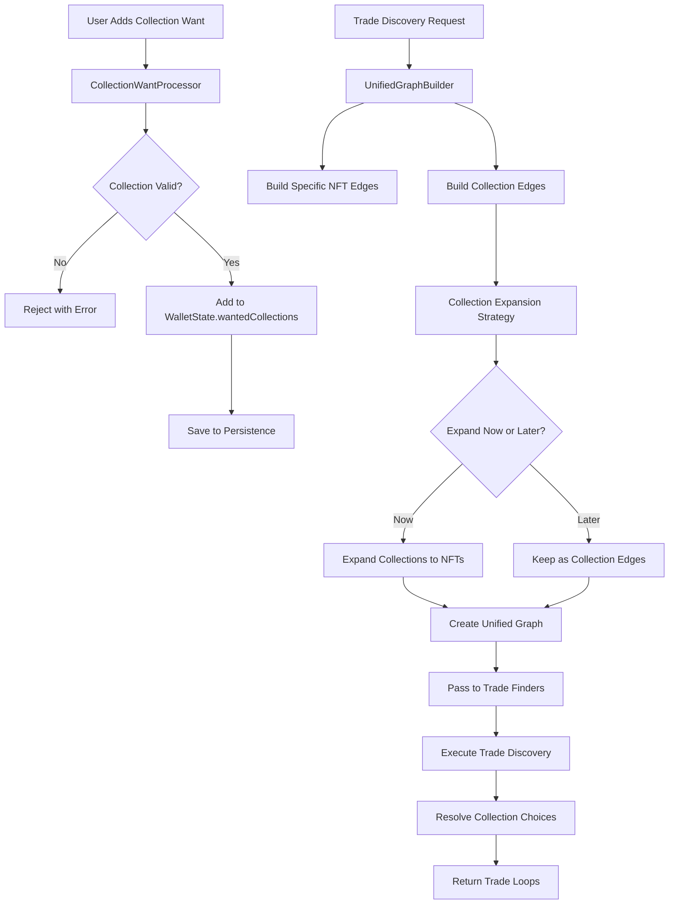

# SWAPS Collection System Architecture

## Overview

This document defines the holistic architecture for handling collection-level wants in the SWAPS trading system. Collection wants allow users to express preferences for "any NFT from collection X" rather than specific NFTs, dramatically increasing liquidity and trade opportunities.

## Core Principles

1. **Unified Data Flow**: Collection wants flow through the system in a predictable, consistent manner
2. **Single Expansion Point**: Collection wants are expanded to specific NFT wants at exactly one point in the pipeline
3. **Graph Abstraction**: The trade graph seamlessly handles both specific NFT wants and collection wants
4. **Performance First**: Collection expansion is optimized and cached to handle large collections
5. **Backward Compatibility**: Existing specific NFT wants continue to work without changes

## Architectural Components

### 1. Data Layer Architecture

```typescript
interface WalletState {
  address: string;
  ownedNfts: Set<string>;
  wantedNfts: Set<string>;           // Specific NFT wants
  wantedCollections: Set<string>;    // Collection-level wants
  lastUpdated: Date;
}

interface TradeGraph {
  nodes: Map<string, WalletNode>;     // wallet address -> node
  edges: Map<string, GraphEdge[]>;    // from wallet -> edges
  collectionEdges: Map<string, CollectionEdge[]>; // collection wants
}

interface GraphEdge {
  from: string;
  to: string;
  nft: string;
  type: 'specific' | 'collection';
  collectionId?: string;
  priority: number;
}
```

### 2. Service Layer Architecture

```
TradeDiscoveryService (Orchestrator)
├── CollectionWantProcessor (NEW)
│   ├── Collection Want Validation
│   ├── Collection Want Expansion
│   └── Collection Want Caching
├── UnifiedGraphBuilder (NEW)
│   ├── Specific NFT Edge Creation
│   ├── Collection Edge Creation
│   └── Hybrid Graph Construction
├── TradeFinderOrchestrator (ENHANCED)
│   ├── Graph Distribution to Finders
│   ├── Result Aggregation
│   └── Collection Resolution
└── Existing Trade Finders (ENHANCED)
    ├── Legacy TradeLoopFinderService
    ├── ScalableTradeLoopFinderService
    └── BundleTradeLoopFinderService
```

### 3. Collection Processing Pipeline



## Implementation Strategy

### Phase 1: Core Infrastructure

1. **Create CollectionWantProcessor**
   - Centralized collection want validation
   - Collection metadata integration
   - Expansion caching and optimization

2. **Create UnifiedGraphBuilder**
   - Single point for graph construction
   - Handles both specific and collection wants
   - Provides consistent interface to all trade finders

3. **Enhance WalletState Management**
   - Ensure collection wants are properly persisted
   - Add collection want validation

### Phase 2: Graph Integration

1. **Update Trade Finder Interfaces**
   - All trade finders receive the same unified graph
   - Remove individual collection handling from each service
   - Standardize on common graph format

2. **Implement Collection Edge Types**
   - Specific edges: wallet wants specific NFT
   - Collection edges: wallet wants any NFT from collection
   - Hybrid traversal algorithms

### Phase 3: Optimization & Resolution

1. **Smart Expansion Strategy**
   - Expand small collections eagerly
   - Keep large collections as edges until resolution
   - Cache expansion results

2. **Collection Resolution Engine**
   - Choose optimal NFT from collection during trade construction
   - Consider rarity, value, and trade balance
   - Support multiple resolution strategies

## Key Architectural Decisions

### Decision 1: When to Expand Collections

**Problem**: Should we expand collections to specific NFTs early (eager) or late (lazy)?

**Solution**: Hybrid approach based on collection size:
- Small collections (< 100 NFTs): Expand eagerly during graph building
- Large collections (> 100 NFTs): Keep as collection edges, expand during resolution
- Cache expansion results to avoid repeated work

### Decision 2: Graph Representation

**Problem**: How do we represent collection wants in the trade graph?

**Solution**: Dual-layer graph:
- Layer 1: Specific NFT edges (existing behavior)
- Layer 2: Collection edges with lazy expansion
- Trade algorithms traverse both layers seamlessly

### Decision 3: Service Boundaries

**Problem**: Which service owns collection logic?

**Solution**: Clear separation of concerns:
- `CollectionWantProcessor`: Collection want management
- `UnifiedGraphBuilder`: Graph construction with collections
- `CollectionAbstractionService`: Collection metadata and resolution
- `TradeFinderServices`: Graph traversal only (no collection logic)

### Decision 4: Backward Compatibility

**Problem**: How do we ensure existing functionality still works?

**Solution**: Additive architecture:
- Existing specific NFT wants remain unchanged
- Collection wants are additional layer
- All existing APIs continue to work
- New collection APIs are opt-in

## Data Flow Specification

### 1. Collection Want Registration

```typescript
// User adds collection want
await tradeDiscovery.addCollectionWant(walletAddress, collectionId);

// Internal flow:
1. CollectionWantProcessor.validateCollection(collectionId)
2. WalletState.wantedCollections.add(collectionId)
3. PersistenceManager.saveWalletState(walletState)
4. CollectionWantProcessor.cacheCollectionMetadata(collectionId)
```

### 2. Trade Discovery with Collections

```typescript
// Trade discovery request
const trades = await tradeDiscovery.findTradeLoops({ considerCollections: true });

// Internal flow:
1. UnifiedGraphBuilder.buildGraph(wallets, nftOwnership, wantedNfts, collectionWants)
2. UnifiedGraphBuilder.expandSmallCollections()
3. UnifiedGraphBuilder.createCollectionEdges() 
4. TradeFinderOrchestrator.distributeGraph(graph)
5. TradeFinderService.findTradeLoops(graph)
6. CollectionResolutionEngine.resolveCollectionChoices(loops)
```

### 3. Graph Traversal with Collections

```typescript
// Enhanced edge traversal
function getWalletsThatWant(nft: string): string[] {
  // Check specific wants
  const specificWanters = wantedNfts.get(nft) || new Set();
  
  // Check collection wants
  const collectionId = getCollectionForNFT(nft);
  const collectionWanters = collectionWants.get(collectionId) || new Set();
  
  return [...specificWanters, ...collectionWanters];
}
```

## Performance Considerations

### Collection Expansion Optimization

1. **Caching Strategy**
   - Cache expanded collection contents for 30 minutes
   - Invalidate cache when new NFTs are detected
   - Use bloom filters for large collections

2. **Batch Processing**
   - Expand multiple collections in parallel
   - Prioritize collections by trade potential
   - Limit expansion to available NFTs only

3. **Memory Management**
   - Stream large collection expansions
   - Use pagination for massive collections
   - Implement backpressure for system protection

### Graph Building Optimization

1. **Incremental Updates**
   - Only rebuild affected subgraphs when collections change
   - Use dirty flags for change tracking
   - Maintain graph version numbers

2. **Parallel Construction**
   - Build specific and collection edges in parallel
   - Use worker threads for CPU-intensive operations
   - Pipeline graph construction steps

## Testing Strategy

### Unit Tests
- Collection want validation
- Collection expansion logic
- Graph building with collections
- Edge traversal algorithms

### Integration Tests
- End-to-end collection want flow
- Multi-algorithm consistency testing
- Performance benchmarks with large collections

### System Tests
- Real-world collection scenarios
- Mixed specific and collection wants
- Error handling and recovery

## Migration Plan

### Phase 1: Infrastructure (Week 1)
- Implement CollectionWantProcessor
- Create UnifiedGraphBuilder
- Add collection fields to WalletState

### Phase 2: Integration (Week 2)
- Update TradeDiscoveryService to use new components
- Migrate existing trade finders to unified graph
- Implement collection edge traversal

### Phase 3: Optimization (Week 3)
- Add collection expansion caching
- Implement performance optimizations
- Add comprehensive testing

### Phase 4: Production (Week 4)
- Deploy with feature flags
- Monitor performance metrics
- Gradual rollout to users

## Success Metrics

1. **Functionality**: Collection wants work in 2-party and multi-party trades
2. **Performance**: No regression in specific NFT trade discovery speed
3. **Scalability**: Handle collections with 10,000+ NFTs efficiently
4. **Compatibility**: All existing functionality continues to work
5. **Quality**: 95%+ test coverage for collection functionality

## Future Enhancements

1. **Smart Collection Recommendations**: AI-powered collection want suggestions
2. **Dynamic Collection Pricing**: Real-time collection floor price integration
3. **Collection Bundles**: Trade multiple collections as bundles
4. **Collection Derivatives**: Support for wrapped/derivative collections
5. **Cross-Chain Collections**: Handle collections across multiple blockchains 