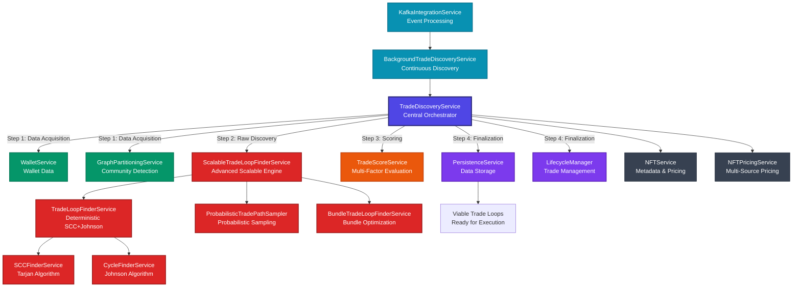

```mermaid
flowchart TD
    %% External Systems
    KIS[KafkaIntegrationService<br/>Event Processing] --> BTDS[BackgroundTradeDiscoveryService<br/>Continuous Discovery]
    
    %% Main Orchestrator
    BTDS --> TDS[TradeDiscoveryService<br/>Central Orchestrator]
    
    %% Step 1: Data Acquisition
    TDS --> |Step 1: Data Acquisition| WS[WalletService<br/>Wallet Data]
    TDS --> |Step 1: Data Acquisition| GPS[GraphPartitioningService<br/>Community Detection]
    
    %% Step 2: Raw Loop Discovery
    TDS --> |Step 2: Raw Discovery| STLFS[ScalableTradeLoopFinderService<br/>Advanced Scalable Engine]
    
    %% Scalable Engine Strategies
    STLFS --> TLFS[TradeLoopFinderService<br/>Deterministic SCC+Johnson]
    STLFS --> PTPS[ProbabilisticTradePathSampler<br/>Probabilistic Sampling]
    STLFS --> BTLFS[BundleTradeLoopFinderService<br/>Bundle Optimization]
    
    %% Supporting Services for Discovery
    TLFS --> SCCFS[SCCFinderService<br/>Tarjan Algorithm]
    TLFS --> CFS[CycleFinderService<br/>Johnson Algorithm]
    
    %% Step 3: Loop Scoring
    TDS --> |Step 3: Scoring| TSS[TradeScoreService<br/>Multi-Factor Evaluation]
    
    %% Step 4: Finalization
    TDS --> |Step 4: Finalization| PS[PersistenceService<br/>Data Storage]
    TDS --> |Step 4: Finalization| LM[LifecycleManager<br/>Trade Management]
    
    %% Supporting Data Services
    TDS --> NFTS[NFTService<br/>Metadata & Pricing]
    TDS --> NFTPS[NFTPricingService<br/>Multi-Source Pricing]
    
    %% Final Output
    PS --> OUTPUT[Viable Trade Loops<br/>Ready for Execution]
    
    %% Styling
    classDef orchestrator fill:#4f46e5,stroke:#312e81,stroke-width:3px,color:#fff
    classDef dataAcq fill:#059669,stroke:#047857,stroke-width:2px,color:#fff
    classDef discovery fill:#dc2626,stroke:#991b1b,stroke-width:2px,color:#fff
    classDef scoring fill:#ea580c,stroke:#c2410c,stroke-width:2px,color:#fff
    classDef finalization fill:#7c3aed,stroke:#5b21b6,stroke-width:2px,color:#fff
    classDef supporting fill:#374151,stroke:#1f2937,stroke-width:1px,color:#fff
    classDef external fill:#0891b2,stroke:#0e7490,stroke-width:2px,color:#fff
    
    class TDS orchestrator
    class WS,GPS dataAcq
    class STLFS,TLFS,PTPS,BTLFS,SCCFS,CFS discovery
    class TSS scoring
    class PS,LM finalization
    class NFTS,NFTPS supporting
    class KIS,BTDS external
``` 